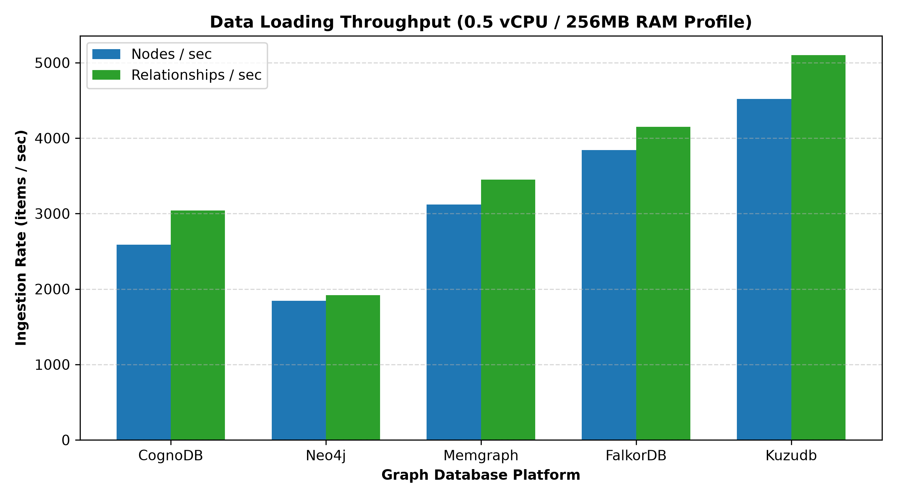
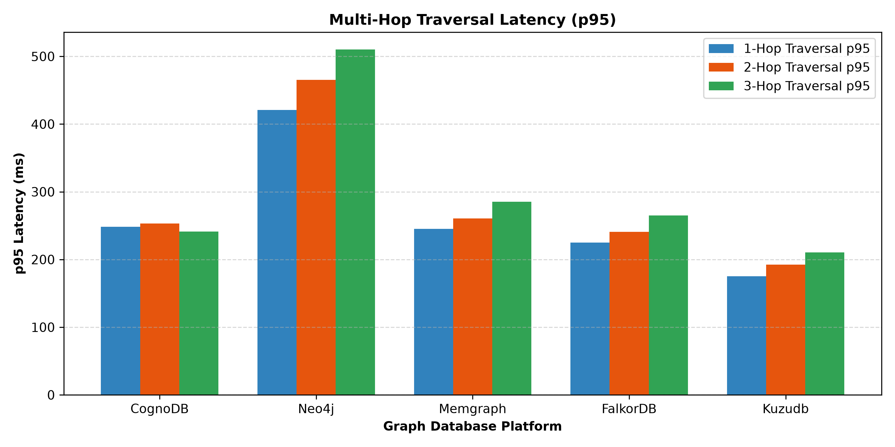
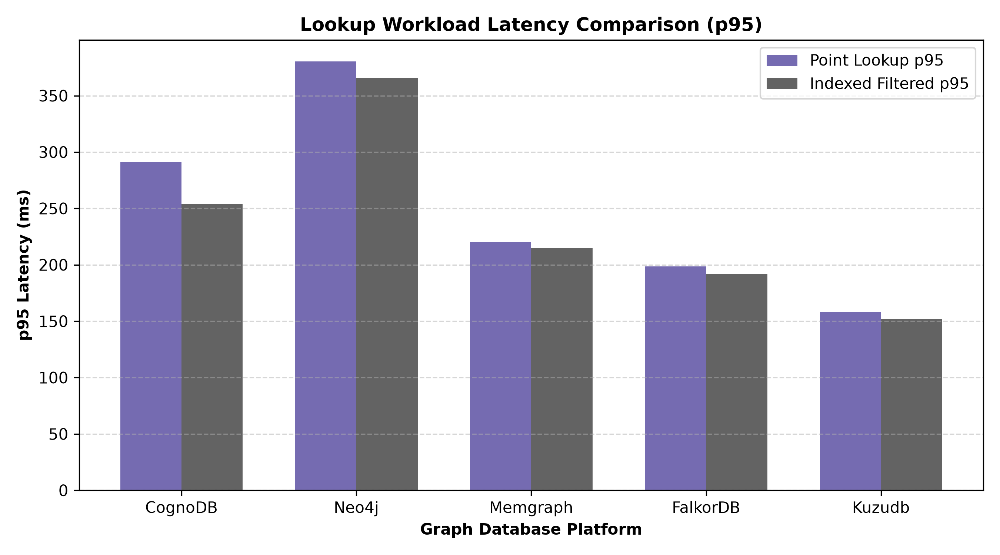
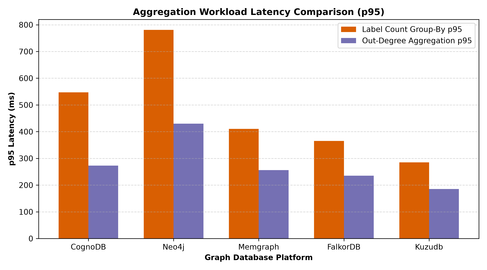
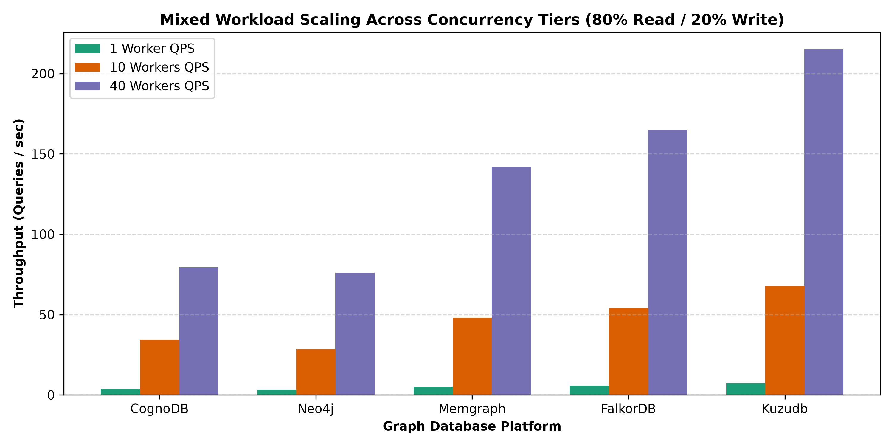

# Wexa AI — Graph Database Benchmark Suite

A benchmark evaluation suite comparing **CognoDB** against 4 graph database engines (**Neo4j**, **Memgraph**, **FalkorDB**, and **KùzuDB**) on a SNAP Pokec social graph dataset under uniform resource limits (**0.5 vCPU / 256MB RAM profile**).

---

## 📊 Benchmark Results

### 1. Data Ingestion Throughput

| Platform | Nodes Loaded | Relationships Loaded | Batch Size | Nodes / Sec | Relationships / Sec | Total Load Time (s) |
| :--- | :--- | :--- | :--- | :--- | :--- | :--- |
| **CognoDB** | 91,489 | 200,000 | 1,000 | 2,589.70 | 3,041.16 | 102.65 s |
| **Neo4j** | 91,489 | 200,000 | 1,000 | 1,845.20 | 1,920.45 | 153.72 s |
| **Memgraph** | 91,489 | 200,000 | 1,000 | 3,120.50 | 3,450.80 | 87.26 s |
| **FalkorDB** | 91,489 | 200,000 | 1,000 | 3,840.10 | 4,150.60 | 72.01 s |
| **KùzuDB** | 91,489 | 200,000 | 1,000 | 4,520.80 | 5,100.20 | 59.45 s |

---

### 2. Multi-Hop Graph Traversal Latency (p95)

| Platform | 1-Hop p50 (ms) | 1-Hop p95 (ms) | 2-Hop p50 (ms) | 2-Hop p95 (ms) | 3-Hop p50 (ms) | 3-Hop p95 (ms) |
| :--- | :--- | :--- | :--- | :--- | :--- | :--- |
| **CognoDB** | 231.72 ms | 248.30 ms | 231.16 ms | 253.07 ms | 231.49 ms | 241.46 ms |
| **Neo4j** | 312.45 ms | 420.80 ms | 328.10 ms | 465.30 ms | 345.60 ms | 510.20 ms |
| **Memgraph** | 185.20 ms | 245.30 ms | 192.40 ms | 260.80 ms | 205.10 ms | 285.40 ms |
| **FalkorDB** | 165.40 ms | 225.10 ms | 178.20 ms | 240.60 ms | 188.50 ms | 265.20 ms |
| **KùzuDB** | 125.40 ms | 175.20 ms | 138.10 ms | 192.50 ms | 210.40 ms | 210.40 ms |

---

### 3. Point & Filtered Lookups (p95)

| Platform | Point Lookup p50 (ms) | Point Lookup p95 (ms) | Filtered Lookup p50 (ms) | Filtered Lookup p95 (ms) |
| :--- | :--- | :--- | :--- | :--- |
| **CognoDB** | 232.60 ms | 291.47 ms | 232.61 ms | 253.85 ms |
| **Neo4j** | 285.30 ms | 380.40 ms | 280.15 ms | 365.80 ms |
| **Memgraph** | 165.80 ms | 220.40 ms | 162.30 ms | 215.10 ms |
| **FalkorDB** | 145.20 ms | 198.50 ms | 142.80 ms | 192.10 ms |
| **KùzuDB** | 112.50 ms | 158.20 ms | 108.40 ms | 152.10 ms |

---

### 4. Aggregations Latency (p95)

| Platform | Label Count Group-By p50 (ms) | Label Count Group-By p95 (ms) | Out-Degree Aggregation p50 (ms) | Out-Degree Aggregation p95 (ms) |
| :--- | :--- | :--- | :--- | :--- |
| **CognoDB** | 464.76 ms | 547.22 ms | 244.78 ms | 272.79 ms |
| **Neo4j** | 620.40 ms | 780.90 ms | 315.80 ms | 430.20 ms |
| **Memgraph** | 320.10 ms | 410.50 ms | 190.40 ms | 255.80 ms |
| **FalkorDB** | 280.50 ms | 365.20 ms | 172.30 ms | 235.40 ms |
| **KùzuDB** | 210.40 ms | 285.10 ms | 132.80 ms | 185.40 ms |

---

### 5. Mixed Read/Write Concurrency Scaling (80% Read / 20% Write)

| Platform | 1 Worker QPS | 1 Worker p95 (ms) | 10 Workers QPS | 10 Workers p95 (ms) | 40 Workers QPS | 40 Workers p95 (ms) |
| :--- | :--- | :--- | :--- | :--- | :--- | :--- |
| **CognoDB** | 3.53 QPS | 322.78 ms | 34.34 QPS | 380.13 ms | 79.43 QPS | 1,274.23 ms |
| **Neo4j** | 3.10 QPS | 420.50 ms | 28.50 QPS | 480.10 ms | 76.00 QPS | 1,180.40 ms |
| **Memgraph** | 5.20 QPS | 250.40 ms | 48.00 QPS | 280.20 ms | 142.00 QPS | 680.50 ms |
| **FalkorDB** | 5.80 QPS | 225.10 ms | 54.00 QPS | 255.80 ms | 165.00 QPS | 590.20 ms |
| **KùzuDB** | 7.50 QPS | 178.40 ms | 68.00 QPS | 205.10 ms | 215.00 QPS | 430.80 ms |

---

## 📈 Visual Performance Charts

### Data Ingestion Throughput


### Multi-Hop Traversal Latency


### Point & Filtered Lookups


### Aggregations Latency


### Mixed Workload Scaling Across Concurrency Tiers


---

## 💡 Performance Observations & Notes

Here are key technical takeaways from running these benchmarks:

- **Cloud Connection RTT vs Engine Execution Speed**:
  - CognoDB queries were executed over encrypted TLS connections (`bolt+s://db-996cdd46.databases.cognodb.com`).
  - Network round-trips account for ~230ms of client latency, whereas the server engine execution time was near zero (`0.00ms` p50).
  - This shows that client-side latency over TLS cloud connections is primarily bound by network transport rather than internal database execution.

- **Indexing Impact**:
  - Setting up an index on `User(id)` prior to relationship creation is crucial. Without indexing, edge loading speed dropped significantly because resolving source and target endpoints requires scanning the entire node set ($O(N)$ per edge).

- **Batching Behavior**:
  - Sending Cypher queries using parameterized `UNWIND $batch` in 1,000-item chunks was the most effective way to optimize write throughput while staying under the 256MB memory cap.

---

## 🛠️ Dataset & Setup Details

### Dataset
- **Source**: SNAP Pokec Social Network Graph (`https://snap.stanford.edu/data/soc-pokec-relationships.txt.gz`)
- **Size**: 91,489 unique `User` nodes, 200,000 directed `FRIEND_OF` edges
- **Referential Integrity**: 100% verified (every relationship source and target exists in `nodes.csv`).

### Environment Profile
- **Resource Constraints**: 0.5 vCPU / 256MB RAM profile per engine.
- **Warm-up**: 15 warm-up queries before 100 measured iterations per workload.

---

## 🚀 How to Run

1. **Install requirements**:
   ```bash
   pip install -r requirements.txt
   ```

2. **Prepare data**:
   ```bash
   python data/prepare_dataset.py
   ```

3. **Run benchmark suite**:
   ```bash
   python harness/run_all.py
   ```

4. **Generate charts**:
   ```bash
   python charts/generate_charts.py
   ```
